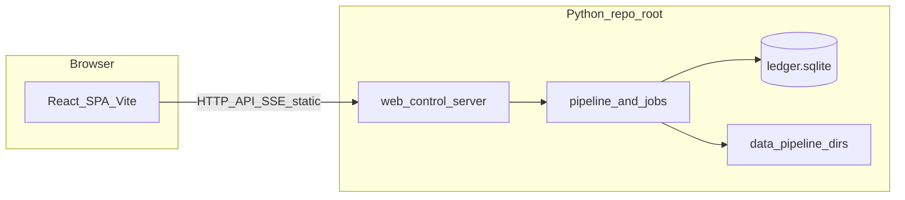

<h1 align="center">Finance Compiler</h1>

<p align="center">
  <strong>Web-first personal finance</strong> — turn exports and balances into a <strong>local SQLite ledger</strong>, then explore it through a dashboard, heatmaps, categorization, and holdings.<br/>
  Automate the same pipelines from the CLI when you want cron or batch runs.
</p>

<p align="center">
  <a href="#overview">Overview</a>
  ·
  <a href="#architecture">Architecture</a>
  ·
  <a href="#quick-start">Quick start</a>
  ·
  <a href="#run-the-web-app">Web app</a>
  ·
  <a href="#spa-development-hot-reload">Frontend dev</a>
  ·
  <a href="#automation-pipeline-cli">CLI</a>
  ·
  <a href="#contributing">Contributing</a>
</p>

<p align="center">
  
  
  
  
</p>

<br/>

## Overview

| | |
| :--- | :--- |
| **What it is** | A React SPA plus a Python **`web_control`** server: dashboard, pipeline runner (SSE logs), heatmap, categorize queue, holdings. |
| **Where data lands** | Canonical store **`data/ledger.sqlite`**; staging under **`data/pipeline/`** — see [`app/backend/config.py`](app/backend/config.py). |
| **Automation** | Same flows via **`python run_pipeline.py`** from the repo root (`cron`, Task Scheduler, headless). |
| **Integrations** | Portal fetch and related behavior via **`config`** / **`pipeline`** (credentials in **`.env`**); Google client libs where Sheets-related flows apply. |

**Layout**

- **`app/backend`** — `pipeline`, `categorization`, `web_control`, [`config.py`](app/backend/config.py), [`logger.py`](app/backend/logger.py), [`schema`](app/backend/schema), [`scripts`](app/backend/scripts).
- **`app/frontend`** — Vite + React + TypeScript ([frontend README](app/frontend/README.md)).

## Architecture



## Quick start

**Prerequisites:** Python **3.11+** (3.12+ recommended), Node **20+** for the SPA (tested on 22), and a venv at the repo root (`.venv`).

### 1. Clone

```bash
git clone <repository-url>
cd <cloned-directory>
```

### 2. Python dependencies

**Recommended:** from the repo root

- **macOS / Linux / Git Bash:** `./install.sh`
- **Windows PowerShell:** `.\install.ps1`

These create `.venv`, run [`app/backend/scripts/generate_requirements.py`](app/backend/scripts/generate_requirements.py), then `pip install -r requirements.txt`.

<details>
<summary><strong>Manual install</strong> (venv + pip only)</summary>

```bash
python -m venv .venv
```

Activate:

- **Windows (cmd):** `.venv\Scripts\activate.bat`
- **Windows (PowerShell):** `.venv\Scripts\Activate.ps1`
- **macOS / Linux:** `source .venv/bin/activate`

```bash
pip install -r requirements.txt
```

</details>

### 3. Build the frontend

```bash
cd app/frontend
npm install
npm run build
cd ../..
```

Output: **`app/frontend/dist/`** (re-run **`npm run build`** after frontend changes for production-style serving).

### 4. Configure

Create **`.env`** in the project root with portal credentials as required by **`config`** / **`pipeline.portal_fetch`**. See [Configuration](#configuration).

### 5. Run

From the **repository root**, with **`PYTHONPATH`** including **`app/backend`** ([details](#python-path-and-working-directory)):

```bash
python -m web_control
```

Open the [dashboard](http://127.0.0.1:8780/) (default port **8780**).

## Python path and working directory

> [!IMPORTANT]
> Use the **repository root** as cwd when running the server or CLI so **`data/`** and **`.env`** resolve correctly. Add **`app/backend`** to **`PYTHONPATH`** so imports like **`web_control`**, **`pipeline`**, and **`config`** work.

**POSIX**

```bash
export PYTHONPATH=app/backend
```

**PowerShell** (repo root)

```powershell
$env:PYTHONPATH = "app/backend"
```

[`main.py`](main.py) and [`run_pipeline.py`](run_pipeline.py) prepend **`app/backend`** automatically **when you run those files only**.

## Configuration

- **`.env`** — Secrets for **`config`** / pipeline fetch. Never commit.
- **`FINANCE_WORKSPACE_ROOT`** — Optional alternate tree with **`data/`** (and optional workspace **`web/`**). See [`app/backend/config.py`](app/backend/config.py).

**HTTP overrides** (`web_control`)

| Variable | Default | Purpose |
|----------|---------|---------|
| `FINANCE_CONTROL_HTTP_HOST` | `127.0.0.1` | Bind address |
| `FINANCE_CONTROL_HTTP_PORT` | `8780` | Port |

## Run the web app

```bash
python -m web_control
```

The VS Code task **Web (Python): control server** runs [`app/backend/scripts/web_control_restart.py`](app/backend/scripts/web_control_restart.py): frees **8780**, sets **`PYTHONPATH`**, starts **`web_control`** from the repo root.

**Windows cmd** without activating the venv:

```cmd
set PYTHONPATH=app\backend
.venv\Scripts\python.exe -m web_control
```

**URLs**

| Page | URL |
|------|-----|
| Dashboard | [http://127.0.0.1:8780/](http://127.0.0.1:8780/) |
| Pipeline | [http://127.0.0.1:8780/pipeline](http://127.0.0.1:8780/pipeline) |
| Heatmap | [http://127.0.0.1:8780/heatmap](http://127.0.0.1:8780/heatmap) |
| Holdings | [http://127.0.0.1:8780/holdings/](http://127.0.0.1:8780/holdings/) |
| Categorize | [http://127.0.0.1:8780/categorize/](http://127.0.0.1:8780/categorize/) |

> [!NOTE]
> If **`app/frontend/dist/`** is missing, the server serves a small placeholder page with build instructions instead of a blank screen.

## SPA development (hot reload)

**Terminal 1** (repo root, `PYTHONPATH=app/backend`)

```bash
python -m web_control
```

**Terminal 2**

```bash
cd app/frontend
npm run dev
```

Open [http://127.0.0.1:5173/](http://127.0.0.1:5173/). Vite proxies **`/api`**, **`/heatmap/api`**, **`/heatmap/legacy-detail`**, **`/heatmap/heatmap_page_script.js`**, **`/categorize`**, and **`/holdings`** to Python on **8780** ([`vite.config.ts`](app/frontend/vite.config.ts)).

More detail: [`app/frontend/README.md`](app/frontend/README.md).

## Browser routes

| Route | What you get |
|-------|----------------|
| **`/`** | Dashboard (empty state if **`data/ledger.sqlite`** is missing). |
| **`/pipeline`** | Pipeline controls with live **SSE** log. |
| **`/heatmap`** | Monthly heatmap and drill-down. |
| **`/categorize/`** | Manual category queue after auto-categorize. |
| **`/holdings/`** | Holdings timeline and ingest. |

## Automation: pipeline CLI

From the **repository root**:

```bash
python run_pipeline.py --help
python run_pipeline.py all
```

**Commands** (each has its own flags: **`python run_pipeline.py COMMAND --help`**): **`route`**, **`holdings`**, **`transactions`**, **`all`**, **`both-process`**. Canonical compiled data: **`data/ledger.sqlite`** ([`pipeline_cli.py`](app/backend/apps/pipeline_cli.py)).

[`run_pipeline.py`](run_pipeline.py) and [`main.py`](main.py) shim to **`apps.pipeline_cli`** with **`app/backend`** on **`sys.path`**.

> [!TIP]
> `run_pipeline.py … --categorize` runs auto-categorization; finish leftovers at **`/categorize/`** while **`python -m web_control`** is running.

## Contributing

Issues and PRs are welcome—pipelines, UI, and docs all improve with more eyes.

- Match style in touched files; keep PRs focused.
- Do not commit secrets or personal exports; use **`FINANCE_WORKSPACE_ROOT`** for an isolated **`data/`** tree when experimenting.
- **Backend:** [`app/backend/pipeline`](app/backend/pipeline), [`app/backend/web_control`](app/backend/web_control), [`config.py`](app/backend/config.py).
- **Frontend:** [`app/frontend/README.md`](app/frontend/README.md).

**Tests** (repo root):

```bash
python -m unittest discover -s tests -p "test_*.py"
```

Suite under **`tests/`** (`unittest`). Context: [`docs/data-architecture-migration-plan.md`](docs/data-architecture-migration-plan.md).

## Security and privacy

> [!WARNING]
> Treat **`.env`** and everything under **`data/`** (exports, **`ledger.sqlite`**, pipeline trees) as **highly sensitive**. Confirm **`.gitignore`** before pushing forks or public branches.

## Utility scripts

From the repo root with **`PYTHONPATH=app/backend`** (unless the script bootstraps paths):

| Command | Purpose |
|---------|---------|
| `python app/backend/scripts/verify_ledger_integrity.py` | Structural audit of the ledger DB ([`pipeline/ledger.py`](app/backend/pipeline/ledger.py)). |
| `python app/backend/scripts/web_control_restart.py` | Free port **8780**, start **`python -m web_control`** with correct **`PYTHONPATH`** and cwd. |

More scripts: [`app/backend/scripts`](app/backend/scripts).

## Screenshots

No bundled screenshots yet. PRs adding anonymized captures under something like **`docs/images/`** (no real account data) are welcome.
