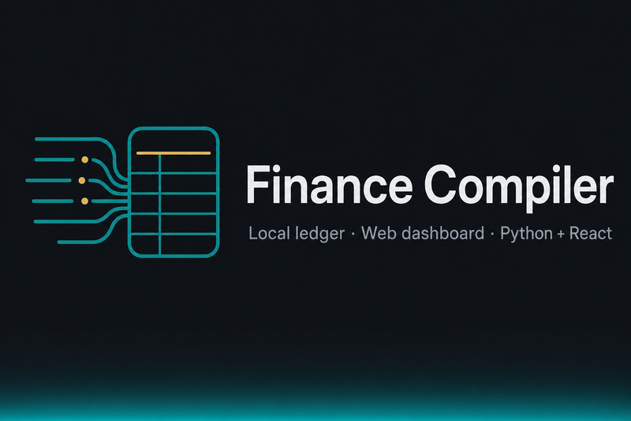

<!-- Hero: centered banner + h1 matches patterns GitHub renders well (see ghostty-org/ghostty README). -->

<h1>
<p align="center">
  
  <br>
  FinCompiler
</p>
</h1>

<p align="center">
  Web-first personal finance: bank exports and balances compile into a <strong>local SQLite ledger</strong>.
  <br>
  Explore it in a dashboard, heatmaps, categorization, and holdings—or run the same pipelines from the CLI.
</p>

<p align="center">
  <a href="https://github.com/ShahafShavit/FinCompiler/stargazers"></a>
  <a href="https://github.com/ShahafShavit/FinCompiler/network/members"></a>
  <a href="https://github.com/ShahafShavit/FinCompiler/blob/main/LICENSE"></a>
  <a href="https://github.com/ShahafShavit/FinCompiler/commits/main"></a>
  <a href="https://github.com/ShahafShavit/FinCompiler/issues"></a>
</p>

<p align="center">
  
  
  
  
</p>

<p align="center">
  <a href="#overview">Overview</a>
  ·
  <a href="#architecture">Architecture</a>
  ·
  <a href="#quick-start">Quick start</a>
  ·
  <a href="#run-the-web-app">Web app</a>
  ·
  <a href="#spa-development-hot-reload">Frontend dev</a>
  ·
  <a href="#automation-pipeline-cli">CLI</a>
  ·
  <a href="#contributing">Contributing</a>
</p>

## Overview

**FinCompiler** is a small **Python backend** plus **React SPA**: ingest spreadsheets, route them through **`data/pipeline/`**, and keep the canonical picture in **`data/ledger.sqlite`** (see [`app/backend/config.py`](app/backend/config.py)).

**What you get**

- **Dashboard** — KPIs and charts when the ledger exists.
- **Pipeline runner** — Run steps from the browser with a live **SSE** log.
- **Heatmap / categorize / holdings** — Drill-down and manual flows without leaving the app.
- **CLI** — `python run_pipeline.py` from the repo root for **cron**, Task Scheduler, or headless runs.

**Repository layout**

- **`app/backend`** — `pipeline`, `categorization`, `web_control`, [`config.py`](app/backend/config.py), [`logger.py`](app/backend/logger.py), [`schema`](app/backend/schema), [`scripts`](app/backend/scripts).
- **`app/frontend`** — Vite + React + TypeScript ([frontend README](app/frontend/README.md)).

Optional portal fetch and Sheets-related flows use **`config`** / **`pipeline`** and secrets in **`.env`**.

## Architecture

```text
┌─────────────┐     HTTP / API / SSE      ┌────────────────┐
│  Browser    │ ◄────────────────────────► │  web_control   │
│  React SPA  │         static `dist/`    │  (Python)      │
└─────────────┘                            └────────┬───────┘
                                                    │
                     ┌──────────────────────────────┼──────────────────────────────┐
                     ▼                              ▼                              ▼
              pipeline jobs                  data/pipeline/                  ledger.sqlite
           (ingest, compile, …)             (inboxes, staging)                (canonical)
```

## Quick start

**Prerequisites:** Python **3.11+** (3.12+ recommended), Node **20+** for the SPA (tested on 22), and a venv at the repo root (`.venv`).

### 1. Clone

```bash
git clone https://github.com/ShahafShavit/FinCompiler.git
cd FinCompiler
```

### 2. Python dependencies

From the repo root, fastest path:

- **macOS / Linux / Git Bash:** `./install.sh`
- **Windows PowerShell:** `.\install.ps1`

These create `.venv`, upgrade `pip`, then `pip install -r requirements.txt`.

<details>
<summary><strong>Manual install</strong> (venv + pip only)</summary>

```bash
python -m venv .venv
```

Activate:

- **Windows (cmd):** `.venv\Scripts\activate.bat`
- **Windows (PowerShell):** `.venv\Scripts\Activate.ps1`
- **macOS / Linux:** `source .venv/bin/activate`

```bash
pip install -r requirements.txt
```

</details>

### 3. Build the frontend

```bash
cd app/frontend
npm install
npm run build
cd ../..
```

Output: **`app/frontend/dist/`**. Re-run **`npm run build`** after frontend changes when serving via Python.

### 4. Configure

Create **`.env`** in the project root with portal credentials as required by **`config`** / **`pipeline.portal_fetch`**. See [Configuration](#configuration).

### 5. Run

From the **repository root**, with **`PYTHONPATH`** including **`app/backend`** ([below](#python-path-and-working-directory)):

```bash
python -m web_control
```

Open [http://127.0.0.1:8780/](http://127.0.0.1:8780/) (default port **8780**).

## Python path and working directory

Use the **repository root** as your current working directory whenever you run the server or CLI so **`data/`** and **`.env`** resolve. Add **`app/backend`** to **`PYTHONPATH`** so **`web_control`**, **`pipeline`**, and **`config`** import cleanly.

**POSIX**

```bash
export PYTHONPATH=app/backend
```

**PowerShell** (repo root)

```powershell
$env:PYTHONPATH = "app/backend"
```

[`main.py`](main.py) and [`run_pipeline.py`](run_pipeline.py) prepend **`app/backend`** when you invoke those files directly.

## Configuration

- **`.env`** — Secrets for **`config`** / pipeline fetch. Never commit.
- **`FINANCE_WORKSPACE_ROOT`** — Optional alternate tree containing **`data/`** (and optional workspace **`web/`**). See [`app/backend/config.py`](app/backend/config.py).

Optional bind/port for **`web_control`**:

| Variable | Default | Purpose |
|----------|---------|---------|
| `FINANCE_CONTROL_HTTP_HOST` | `127.0.0.1` | Bind address |
| `FINANCE_CONTROL_HTTP_PORT` | `8780` | Port |

## Run the web app

```bash
python -m web_control
```

The VS Code task **Web (Python): control server** runs [`app/backend/scripts/web_control_restart.py`](app/backend/scripts/web_control_restart.py): frees port **8780**, sets **`PYTHONPATH`**, starts **`web_control`** from the repo root.

**Windows cmd** without activating the venv:

```cmd
set PYTHONPATH=app\backend
.venv\Scripts\python.exe -m web_control
```

| Page | URL |
|------|-----|
| Dashboard | [http://127.0.0.1:8780/](http://127.0.0.1:8780/) |
| Pipeline | [http://127.0.0.1:8780/pipeline](http://127.0.0.1:8780/pipeline) |
| Heatmap | [http://127.0.0.1:8780/heatmap](http://127.0.0.1:8780/heatmap) |
| Holdings | [http://127.0.0.1:8780/holdings/](http://127.0.0.1:8780/holdings/) |
| Categorize | [http://127.0.0.1:8780/categorize/](http://127.0.0.1:8780/categorize/) |

If **`app/frontend/dist/`** is missing, you get a placeholder page with build instructions instead of a blank screen.

## SPA development (hot reload)

**Terminal 1** (repo root, `PYTHONPATH=app/backend`):

```bash
python -m web_control
```

**Terminal 2**

```bash
cd app/frontend
npm run dev
```

Open [http://127.0.0.1:5173/](http://127.0.0.1:5173/). Vite proxies **`/api`**, **`/heatmap/api`**, **`/heatmap/legacy-detail`**, **`/heatmap/heatmap_page_script.js`**, **`/categorize`**, and **`/holdings`** to Python on **8780** ([`vite.config.ts`](app/frontend/vite.config.ts)).

More detail: [`app/frontend/README.md`](app/frontend/README.md).

## Browser routes

| Route | Description |
|-------|-------------|
| **`/`** | Dashboard (empty state if **`data/ledger.sqlite`** is missing). |
| **`/pipeline`** | Pipeline controls with live **SSE** log. |
| **`/heatmap`** | Monthly heatmap and drill-down. |
| **`/categorize/`** | Manual category queue after auto-categorize. |
| **`/holdings/`** | Holdings timeline and ingest. |

## Automation: pipeline CLI

From the **repository root**:

```bash
python run_pipeline.py --help
python run_pipeline.py all
```

Commands (each has its own flags—use **`python run_pipeline.py COMMAND --help`**): **`route`**, **`holdings`**, **`transactions`**, **`all`**, **`both-process`**. Canonical compiled store: **`data/ledger.sqlite`** ([`pipeline_cli.py`](app/backend/apps/pipeline_cli.py)).

[`run_pipeline.py`](run_pipeline.py) and [`main.py`](main.py) delegate to **`apps.pipeline_cli`** with **`app/backend`** on **`sys.path`**.

`run_pipeline.py … --categorize` runs auto-categorization; finish remaining rows at **`/categorize/`** while **`python -m web_control`** is running.

## Contributing

Issues and PRs are welcome.

- Match existing style in touched files; keep changes focused.
- Do not commit secrets or personal exports; use **`FINANCE_WORKSPACE_ROOT`** for an isolated **`data/`** tree when experimenting.
- **Backend:** [`app/backend/pipeline`](app/backend/pipeline), [`app/backend/web_control`](app/backend/web_control), [`config.py`](app/backend/config.py).
- **Frontend:** [`app/frontend/README.md`](app/frontend/README.md).

Tests from the repo root:

```bash
python -m unittest discover -s tests -p "test_*.py"
```

Suite lives under **`tests/`** (`unittest`). Background: [`docs/data-architecture-migration-plan.md`](docs/data-architecture-migration-plan.md).

## Security and privacy

Treat **`.env`** and **`data/`** (exports, **`ledger.sqlite`**, pipeline trees) as sensitive. Confirm **`.gitignore`** before pushing forks or public branches.

## Utility scripts

Run from the repo root with **`PYTHONPATH=app/backend`** unless the script bootstraps paths itself:

| Command | Purpose |
|---------|---------|
| `python app/backend/scripts/verify_ledger_integrity.py` | Structural audit of the ledger DB ([`pipeline/ledger.py`](app/backend/pipeline/ledger.py)). |
| `python app/backend/scripts/web_control_restart.py` | Free port **8780**, start **`python -m web_control`** with correct **`PYTHONPATH`** and cwd. |

Additional scripts: [`app/backend/scripts`](app/backend/scripts).

## License

Released under the [MIT License](LICENSE).

## Screenshots

None bundled yet. PRs with anonymized UI captures under something like **`docs/images/`** (no real account data) are welcome.
